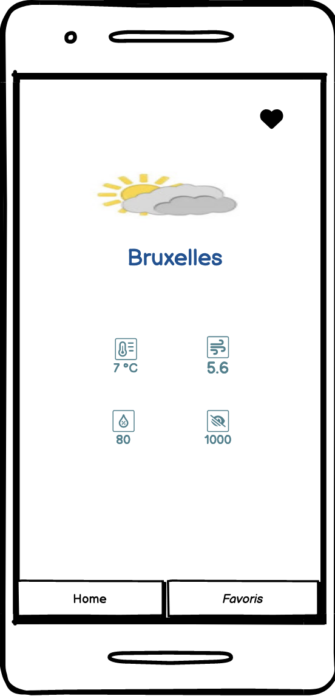
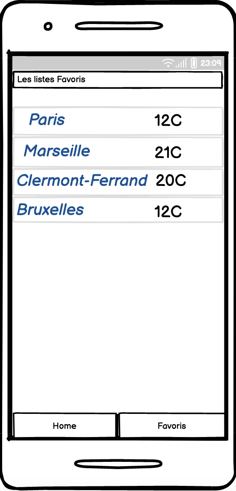
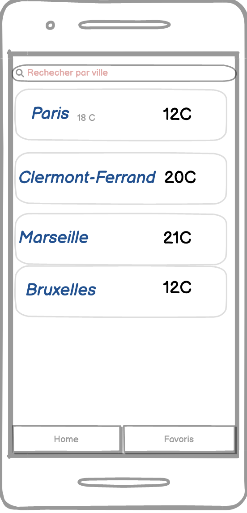
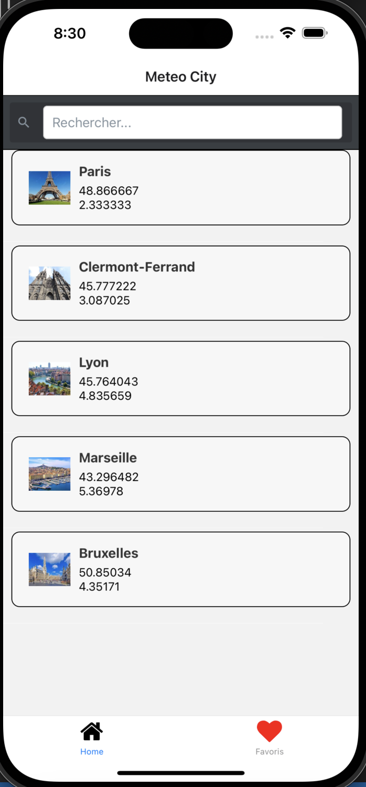
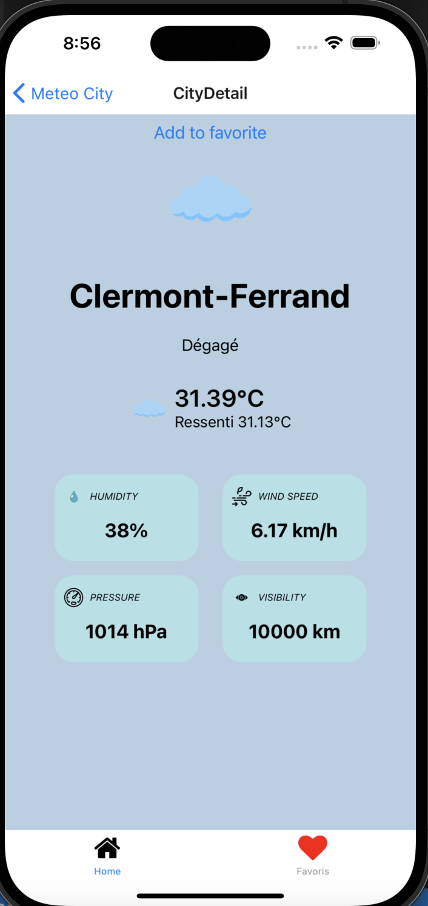
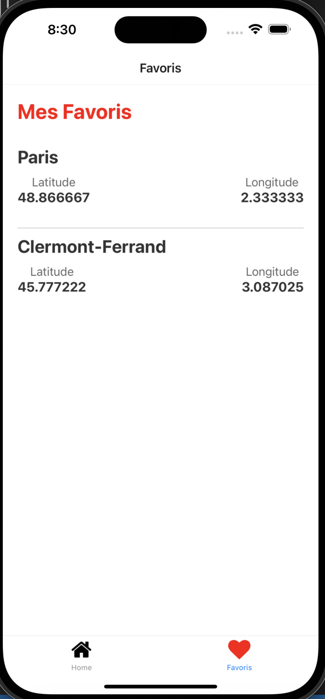

# Description de l'application :
Notre application est conçue pour fournir les informations météorologiques des grandes villes de France. Elle tire parti de l'API <a href="https://iut-weather-api.azurewebsites.net/swagger-ui/">WEATHER API</a>. Grâce à cette application, les utilisateurs peuvent également ajouter des villes à leurs favoris pour accéder plus facilement à leur météo.

L'application commence par une page présentant la liste des villes disponibles dans l'API. Les utilisateurs ont la possibilité de rechercher une ville en utilisant la barre de recherche. Lorsqu'un utilisateur clique sur l'une des villes de la liste, les détails météorologiques de cette ville s'affichent, accompagnés d'un bouton favori permettant de choisir si la ville doit être ajoutée aux favoris. Les villes marquées comme favoris sont ensuite affichées dans une liste dédiée sur la page des favoris.

### Installation

```
$ npm install
```

### Démarrage le serveur de développement

```
$ npx expo start
```


## Les Sketchs :
Accueil                 |   Page Detail      |  Page Favoris                
:-------------------------:|:-------------------------:|:-------------------------:
  | | 

## Les Captures d'écrans :
Accueil                 |   Page Detail      |  Page Favoris                
:-------------------------:|:-------------------------:|:-------------------------:
   |  | 


## Liste de Notation :

* :white_check_mark: Application sketches 
  
* :white_check_mark: A Readme describing your project/application. 
* :white_check_mark: Navigation 
* :white_check_mark: Read data from redux store 
* :white_check_mark: Update data to redux store using redux-thunk (API AND|OR AsyncStorage) 
* :white_check_mark: Display list of items 
* :white_check_mark: Display dynamic image 
 
* :white_check_mark: Binding child component props 

* :white_check_mark:  Handle a TextInput correctly 
* :white_check_mark:  Handle fetch success callback 
* :white_check_mark:  Handle fetch error callback 
* :white_check_mark:  Store favorite data into phone storage 


## Author : 
* <a >NAJLAE LAMBARAA</a>
* <a >ARAFA MAMADOU ELAPHI</a>
